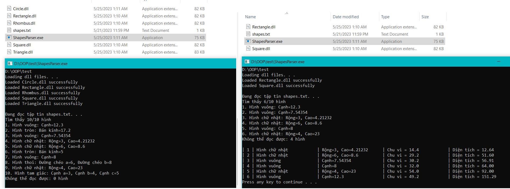
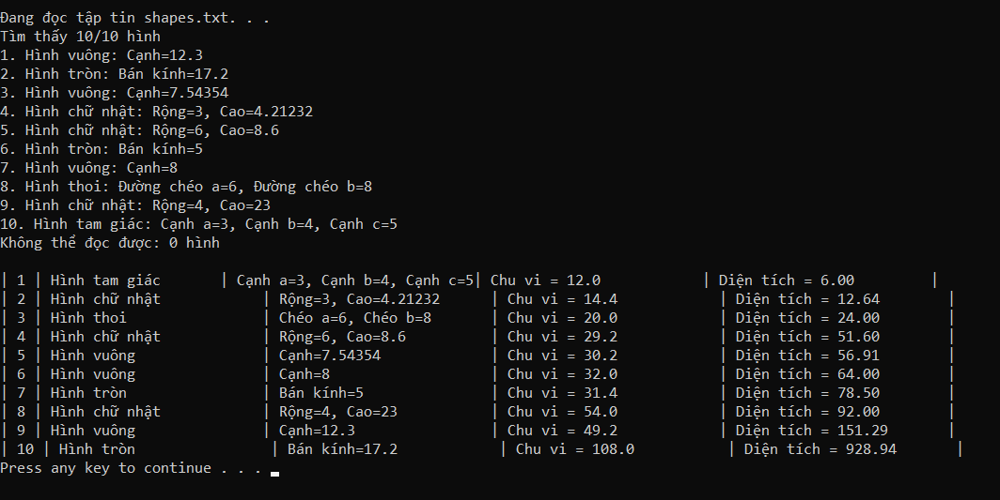
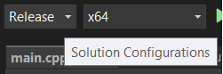
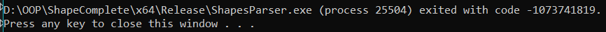

# **TÀI LIỆU MÔ TẢ HỆ THỐNG CHƯƠNG TRÌNH SHAPES PARSER**
- Phiên bản tài liệu: 1.0
- Ngày viết: 25/05/2023
## **1. GIỚI THIỆU**
### **1.1. TÁC GIẢ**
- Mã số sinh viên: 21120262
- Họ tên : Nguyễn Huỳnh Hữu Khang
- Giáo viên hướng dẫn: ThS.Trần Duy Quang
- Lớp: 21_3
### **1.2. CHƯƠNG TRÌNH**
Đọc file shapes.txt chứa các thông tin hình học. Sau đó xử lý thông tin số liệu, tính chu vi, diện tích và hiển thị ra màn hình.
### **1.3. TỔNG QUAN VỀ TÀI LIỆU**
- Mô tả cấu trúc file, luồng xử lý dữ liệu.
- Mô tả chức năng các hàm trong chương trình.
- Hướng dẫn build file thực thi và file thư viện liên kết động.
## **2. TỔNG QUAN HỆ THỐNG**
### **2.1. BỐI CẢNH HỆ THỐNG**
- File shapes.txt chứa thông tin hình học.
- File ShapesParser.exe sẽ thực hiện việc đọc thông tin từ shapes.txt sau đó đem đi xử lý, tính toán và hiển thị ra màn hình.
- Số lượng hình mà file ShapesParser.exe có thể xử lý được tuỳ theo các thư viện dll hiện có, ví dụ Square.dll, Rectangle.dll,...
### **2.2. KIẾN TRÚC HỆ THỐNG**
#### _shapes.txt_
- dòng đầu là số dòng dữ liệu hình học.
- từng dòng bên dưới có cấu trúc "Tên hình: thuộc tính 1=..., thuộc tính 2=...". VD: Rectangle: w=4, h=2
#### _ShapesParser_
- IParser.h
    - là interface của parser.
    - để phân tích dữ liệu xâu rồi từ đó chuyển sang dữ liệu để tạo nên đối tượng hình học.
- IShapeToStringConverter.h
    - là interface converter.
    - ngược lại với parser, dùng để chuyển đổi các dữ liệu số sang dữ liệu xâu để hiển thị ra màn hình.
- ListShape.h
    - lưu trữ shapes và strategy converter.
    - hàm in thông tin thuộc tính của hình học.
    - sắp xếp lại danh sách hình theo thứ tự diện tích tăng dần.
    - in thông tin hình kèm theo chu vi diện tích.
- ParserFactory.h
    - là class factory có thuộc tính lưu trữ parser ứng với loại hình.
    - hàm đăng kí parser mới.
    - hàm chọn parser.
- Shape.h
    - interface hình học.
    - hàm lấy các thuộc tính hình học.
    - hàm tính chu vi.
    - hàm tính diện tích.
- StringConverterStrategy.h
    - là class strategy lưu trữ converter theo loại hình học.
    - có hàm thêm converter mới.
    - hàm set strategy để chọn converter đúng với loại hình.
- utils.h
    - chứa các khai báo thư viện c++.
    - biến vector tĩnh lưu trữ thư viện tĩnh để giải phóng khi kết thúc chương trình.
    - hàm lấy path của file ShapesParser.exe.
    - hàm đọc thư viện dll.
    - hàm giải phóng thư viện dll.

#### _Square.dll_ (các thư viện hình học dll nói chung, ví dụ ở đây là Square)
- framework.h, pch.h, dllmain.cpp, cpp.hint: các file config thư viện dll mà c++ build sẵn.
- Square.h
    - Khai báo class Square kế thừa class Shape, có thuộc tính hình học của hình vuông là 1 cạnh.
    - Hàm constructor với tham số là giá trị cho thuộc tính.
    - Hàm lấy thuộc tính thuộc class Square, override từ Shape interface.
    - Hàm tính chu vi thuộc class Square, override từ Shape interface.
    - Hàm tính diện tích thuộc class Square, override từ Shape interface.
    - Hàm lấy instance SquareParser.
    - Hàm lấy instance SquareToStringConverter.
- SquareParser.h
    - Khai báo class SquareParser kế thừa class IParser.
    - Gồm các đoạn mã cài đặt class thành singleton.
    - Class có hàm parse override interface của nó.
- SquareToStringConverter.h
    - Khai báo class SquareToStringConverter kế thừa class IShapeToString.
    - Gồm các đoạn mã cài đặt class thành singleton.
    - Class có hàm convertData override interface của nó.
    - Class có hàm convertDataCVDT override interface của nó.

### **2.3. DÒNG HOẠT ĐỘNG DỮ LIỆU CỦA HỆ THỐNG**
- Đầu tiên lấy đường dẫn hiện tại của file ShapesParser.exe, từ đường dẫn này đọc các file .dll hiện có ở đây.
- Với mỗi dll đọc được sẽ thêm parser từ dll vào factory, converter từ dll vào strategy.
- Tiến hành đọc file shapes.txt. Với mỗi dòng sẽ xử lý tách ra loại hình học trước. Sau đó chọn ra parser tương ứng với loại hình này, truyền dữ liệu còn lại của dòng rồi tiến hành parse trả ra đối tượng hình học.
- Các đối tượng hình học parse thành công được lưu vào danh sách, các đối tượng thất bại (do không có parser phù hợp, hay dữ liệu sai format) được đem đi đếm.
- Truyền danh sách các hình đọc thành công và strategy coverter vào class ListShape.
- Từ ListShape gọi lệnh in loại hình và thuộc tính của hình, sắp xếp hình, in hình tăng dần theo diện tích.

### **2.4. TÍNH NĂNG CỦA HỆ THỐNG**
#### 2.4.1. Đọc file
- Đọc file dữ liệu hình học.
#### 2.4.2. Hiển thị
- Hiển thị các dữ liệu đọc được ra màn hình, có thể có chu vi, diện tích
#### 2.4.3. Tiêm động đối tượng hình học
- Tuỳ theo file .dll hiện có mà sẽ xử lý được bấy nhiêu hình.



## **3. GIẢI THÍCH CÁC FUNCTION, METHOD**
### **3.1. ShapesParser**
#### **_utils.h_**
```c++
string GetCurrentDirectory()
```
- Input: không.
- Chức năng: lấy ra path của file .exe đang thực thi.
- Output: path.
```c++
void readfileDLL(ParserFactory& factory, StringConverterStrategy& strategy,string& fileName)
```
- Input: factory parser, strategy converter, tên file dll.
- Chức năng: mở và đọc file dll, lấy instace ShapeParser, ShapeToStringConverter đăng kí vào factory và strategy, lưu trữ thư viện dll vào vector thư viện.
- Output: factory, strategy.
```c++
 void freeLibs()
 ```
- Input: không.
- Chức năng: giải phóng tất cả thư viện dll.
- Output: không.
#### **_Shape.h_**
- Là interface cho các thể loại hình học.
```c++
virtual vector<double> getAttribute() = 0
```
- sẽ được định nghĩa ở các hình kế thừa class này. Chức năng là lấy ra các thuộc tính của loại hình.
```c++
virtual double chuvi() = 0
```
- sẽ được định nghĩa ở các hình kế thừa class. Chức năng tính chu vi của loại hình tương ứng.
```c++
virtual double dientich() = 0
```
- sẽ được định nghĩa ở các hình kế thừa class. Chức năng tính diện tích của loại hình tương ứng.
#### **_IParser.h_**
- Là interface cho các parser
```c++
virtual shared_ptr<Shape> parse(stringstream data) = 0
``` 
- được định nghĩa bởi các class kế thừa.
- Input: dữ liệu có kiểu stringstream.
- Chức năng: chuyển đổi dữ liệu từ stringstream sang hình học có các số đo của nó.
- Output: đối tượng hình học với số liệu cạnh của hình đó.
#### **_IShapeToStringConverter.h_**
- Là interface cho các converter
```c++
virtual wstring convertData(shared_ptr<Shape>) = 0
``` 
- được định nghĩa bởi các class kế thừa.
- Input: con trỏ thông minh đối tượng Shape.
- Chức năng: chuyển đổi các số liệu cạnh của hình về xâu, ghép thành 1 xâu thông tin.
- Output: xâu thông tin.
```c++
virtual wstring convertDataCVDT(shared_ptr<Shape>) = 0
``` 
- được định nghĩa bởi các class kế thừa.
- Input: con trỏ thông minh đối tượng Shape.
- Chức năng: chuyển đổi các số liệu cạnh, chu vi, diện tích của hình về xâu, thêm khoảnh cách cho từng thông tin, ghép thành 1 xâu thông tin.
- Output: xâu thông tin.
#### **_ParserFactory.h_**
- Là nhà máy parser các đối tượng hình học.
- Có thuộc tính map<'string,shared_ptr<'IParser'>'>prototype chứa đăng kí loại hình với một parser tương ứng.
```c++
void registerWith(string type, shared_ptr<IParser> parser)
```
- Input: tên của loại hình, parser tương ứng.
- Chức năng: đăng kí hình và parser vào factory.
- Output: không.

```c++
shared_ptr<IParser> select(string type)
```
- Input: tên loại hình.
- Chức năng: chọn loại parser đã đăng kí ứng với hình.
- Output: parser tương ứng.
#### **_StringConverterStrategy.h_**
- Là strategy chuyển đổi đối tượng hình học sang xâu dữ liệu.
- Có thuộc tính map<'string,shared_ptr<'IShapeToStringConverter'>'>prototype chứa đăng kí loại hình với một converter tương ứng.

```c++
void registerWith(string type, shared_ptr<IShapeToStringConverter> converter)
```
- Input: tên của loại hình, converter tương ứng.
- Chức năng: đăng kí hình và converter vào strategy.
- Output: không.

```c++
shared_ptr<IShapeToStringConverter> set_strategy(string type)
```
- Input: tên loại hình.
- Chức năng: cài đặt lại loại converter đã đăng kí ứng với hình.
- Output: converter tương ứng.
#### **_ListShape.h_**
- Là một đối tượng danh sách hình để lưu trữ hình học và có các method in hình học.
- Thuộc tính:
    - vector<shared_ptr<'Shape'>> _shapes: vector lưu trữ các hình.
    - StringConverterStrategy _strategy: strategy chuyễn đổi hình sang xâu.
```c++
ListShape(vector<shared_ptr<Shape>>&, StringConverterStrategy&)
```
- Hàm constructor: truyền vào danh sách hình và strategy cho 2 thuộc tính của class.
```c++
void printShape()
```
- Input: không.
- Chức năng: in ra format như "Hình vuông: cạnh=2"
- Output: không.

```c++
void sortAreaByAsc()
```
- Input: không.
- Chức năng: sắp xếp danh sách hình theo diện tích tăng dần.
- Output: không.

```c++
void printShapeComplete()
```
- Input: không.
- Chức năng: in ra format như "Hình vuông | Cạnh=2 | Chu vi = 8 | Diện tích = 4"
- Output: không.

### **3.2. Shape (dll)**
#### **_Shape.h_**
- Định nghĩa API.
- Khai báo class Shape
    - Thuộc tính.

    | Hình   | Thuộc tính |
    | ------ | ---------- |
    |Vuông | cạnh|
    |Tròn | bán kính|
    |Chữ nhật | dài, rộng|
    |Tam giác | cạnh a, cạnh b, cạnh c|
    |Thoi | đường chéo a, đường chéo b|
- Các method của Shape
```c++
vector<double> getAttribute() override
```
- Input: không
- Chức năng: lấy ra thuộc tính của hình.
- Output: vector thuộc tính

```c++
double chuvi() override
```
- Input: không.
- Chức năng: tính chu vi của hình.
- Output: chu vi của hình.
```c++
double dientich() override
```
- Input: không.
- Chức năng: tính diện tích của hình.
- Output: diện tích của hình.

| Hình   | Thuộc tính | Chu vi | Diện tích |
| ------ | ---------- |--------|-----------|
|Vuông | cạnh| cạnh x 4 | cạnh x cạnh
|Tròn | bán kính| bán kính x 2 x 3.14 | bán kính x bán kính x 3.14
|Chữ nhật | dài, rộng| (dài + rộng) x 2 | dài x rộng
|Tam giác | cạnh a, cạnh b, cạnh c| cạnh a + cộng b + cộng c | Heron
|Thoi | đường chéo a, đường chéo b|2 x sqrt(chéo a^2 + chéo b^2) | chéo a  x chéo b / 2
- Các hàm phụ trợ
```c++
extern "C" 'SHAPE'_API shared_ptr<IParser> getParser()
```
- Input: không.
- Chức năng: lấy instance shape parser, được gọi ở chương trình thực thi.
- Output: không
```c++
extern "C" 'SHAPE'_API shared_ptr<IShapeToStringConverter> getToStringConverter()
```
- Input: không.
- Chức năng: lấy instance shape converter, được gọi ở chương trình thực thi.
- Output: không
#### **_ShapeParser.h_**
##### Singleton Pattern
- Instace
- Constructor
- Huỷ tạo copy
- Tạo instance
##### Hàm chức năng chính
```c++
shared_ptr<Shape> parse(stringstream data)
```
- Input: dòng dữ liệu xâu.
- Chức năng: phân tích cú pháp xâu thành các số liệu hình học.
- Output: đối tượng hình học với các số liệu thuộc tính.

| Hình | Format | Thuộc tính |
| -----|------- | ---------- |
|Vuông |a=1| cạnh|
|Tròn | r=1|bán kính|
|Chữ nhật|w=1, h=2| dài, rộng|
|Tam giác|a=3, b=4, c=5 | cạnh a, cạnh b, cạnh c|
|Thoi |d1=1, d2=2| đường chéo a, đường chéo b|
#### **_ShapeToStringConverter.h_**
##### Singleton Pattern
- Instace
- Constructor
- Huỷ tạo copy
- Tạo instance
##### Hàm chức năng chính
```c++
wstring convertData(shared_ptr<Shape>)
```
- Input: con trỏ thông minh đối tượng hình học.
- Chức năng: chuyển đổi sang xâu format:"Hình: thuộc tính="
- Output: xâu thông tin.
```c++
wstring convertDataCVDT(shared_ptr<Shape>)
```
- Input: con trỏ thông minh đối tượng hình học.
- Chức năng: chuyển đổi sang xâu format:"Hình| thuộc tính=|Chu vi=|Diện tích="
- Output: xâu thông tin.

 

## **4. HƯỚNG DẪN CÀI ĐẶT, SỬ DỤNG HỆ THỐNG**
### **4.1. Config**
- Solution config:


- Project config:
    - ShapesParser: sử dụng phiên bản c++ 20. All header files are public: yes.
    - Shape(dll): sử dụng phiên bản c++ 20. Additional incldue directories: $(SolutionDir)ShapesParser.
### **4.2. Cài đặt và sử dụng**
- Build Solution.
- Đặt các file: ShapesParser.exe, các thư viện dll, shapes.txt vào cùng 1 folder.
- Click vào file ShapesParser để chạy chương trình.
## **5. VẤN ĐỀ TỒN ĐỘNG**
- Các thư viện dll có thể giải phóng được nhưng xuất báo lỗi khi kết thúc chương trình.

- Tuy không giải phóng thư viện dll chương trình vẫn hoạt động được, nhưng vẫn mong nhận được giải pháp của bạn khi đọc xong tài liệu này.
- Giải pháp tạm thời: không giải phóng thư viện dll.
## **6. TÀI LIỆU THAM KHẢO**
- [Hướng dẫn tạo thư viện Dll](https://stackoverflow.com/questions/76060757/how-to-inject-a-dll-file-dynamically-into-a-program-at-runtime-using-the-depend)
- [regex](https://regexr.com/)
- [Kĩ thuật c++](https://tdquang7.notion.site/Lab-01-C-c-ki-n-th-c-c-s-213388d9341445868468261497d7676a)
- [Smart pointer](https://learn.microsoft.com/en-us/cpp/cpp/smart-pointers-modern-cpp?view=msvc-170)